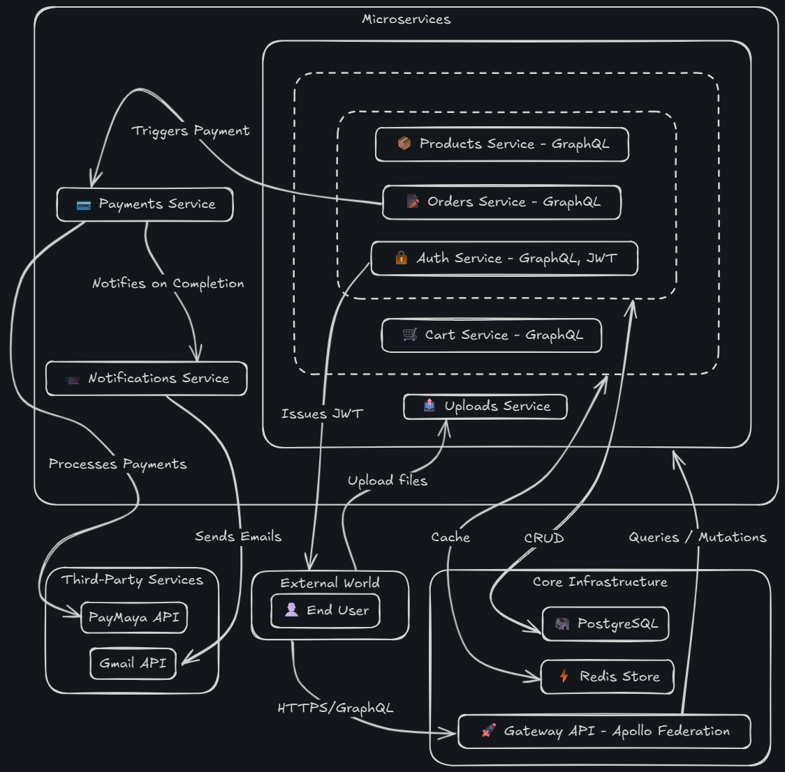

# Mercado


[](LICENSE)



## 📝 Description

Mercado is a comprehensive, production-ready e-commerce backend built on a scalable microservices architecture using NestJS. This project simulates a real-world, distributed system by implementing 8 distinct services—including authentication, payments, and notifications—all unified behind a GraphQL Federation gateway. It demonstrates best practices in domain-driven design, hybrid data persistence, and resilient, containerized deployments.

## 📖 Table of Contents

- [📝 Description](#-description)
- [✨ Features](#-features)
- [💻 Technologies Used](#️-technologies-used)
- [🛠️ Setup Project](#-setup-project)
  - [🍴 Prerequisites](#-prerequisites)
  - [🚀 Install Project](#-install-project)
- [🤝 Contributing and Support](#-contributing-and-support)
  - [⚒️ How to Contribute](#️-how-to-contribute)
  - [📩 Bug Report](#-bug-report)
- [📜 Credits](#-credits)
- [📞 Contact Me](#-contact-me)
- [📋 License](#-license)

## ✨ Features

👉 **True Microservices Architecture**: Features 8 distinct services (Auth, Products, Cart, Orders, Payments, Notifications, Uploads, Gateway) with clean domain boundaries.

👉 **GraphQL Federation**: Utilizes Apollo Gateway to create a seamless, unified data graph from multiple underlying GraphQL services.

👉 **Secure JWT Authentication**: A dedicated auth service handles user registration and login, securing the system with JSON Web Tokens.

👉 **Hybrid Data Persistence**: Employs PostgreSQL with Prisma for critical, structured data (Users, Products, Orders) and Redis for high-speed, ephemeral data like shopping carts.

👉 **Real-World Payment Processing**: Integrates with the PayMaya API to handle actual test transactions, not just mock data.

👉 **Reliable Email Notifications**: A robust notifications service uses Gmail OAuth2 to send transactional emails for events like order confirmation.

👉 **Dedicated Image Upload Service**: Isolates file handling logic into its own service for managing product image uploads with validation.

👉 **Containerized Environment**: Fully containerized with Docker, ensuring consistent and reproducible setups across development and production.

## 💻 Technologies Used

- NestJS
- GraphQL w/ Apollo Federation
- TypeScript
- PostgreSQL w/ Prisma
- Redis
- Docker
- JWT (JSON Web Tokens)
- PayMaya API
- Nodemailer with Gmail OAuth2
- Pino (for logging)

<!-- - [![Next.js][Next.js]][Next-url]
- [![React.js][React.js]][React-url]
- [![TypeScript][TypeScript]][TypeScript-url]
- [![TailwindCSS][TailwindCSS]][TailwindCSS-url]
- [![MongoDB][MongoDB]][MongoDB-url]
- [![Zod][Zod]][Zod-url]

[Next.js]: https://img.shields.io/badge/Next-black?style=for-the-badge&logo=next.js&logoColor=white
[Next-url]: https://nextjs.org/
[React.js]: https://img.shields.io/badge/react-%2320232a.svg?style=for-the-badge&logo=react&logoColor=%2361DAFB
[React-url]: https://react.dev/
[TypeScript]: https://img.shields.io/badge/typescript-%23007ACC.svg?style=for-the-badge&logo=typescript&logoColor=white
[TypeScript-url]: https://www.typescriptlang.org/
[TailwindCSS]: https://img.shields.io/badge/tailwindcss-%2338B2AC.svg?style=for-the-badge&logo=tailwind-css&logoColor=white
[TailwindCSS-url]: https://tailwindcss.com/
[MongoDB]: https://img.shields.io/badge/MongoDB-%234ea94b.svg?style=for-the-badge&logo=mongodb&logoColor=white
[MongoDB-url]: https://www.mongodb.com/
[Zod]: https://img.shields.io/badge/zod-%233068b7.svg?style=for-the-badge&logo=zod&logoColor=white
[Zod-url]: https://zod.dev/ -->

## 🛠️ Setup Project

To get this project up and running in your development environment, follow these step-by-step instructions.

### 🍴 Prerequisites

We need to install or make sure that these tools are pre-installed on your machine:

- [Node.js](https://nodejs.org/en)
- [pnpm](https://pnpm.io/)
- [Git](https://git-scm.com/downloads)
- [Docker](https://www.docker.com/)

### 🚀 Install Project

1. Clone the Repository

```bash
git clone https://github.com/janrizmlibres/mercado-ecommerce.git
```

2. Navigate to the project directory and install all dependencies using pnpm

```bash
cd mercado-ecommerce
pnpm install
```

3. Set up the environment variables. Each service in the `/apps` directory requires its own `.env` file. You can create these by copying the provided `.env.example` files (if available) and filling in the required credentials for databases, APIs, etc.

<!-- ```bash
AUTH_SECRET="YOUR_AUTH_SECRET" # Added by `npx auth`. Read more: https://cli.authjs.dev
AUTH_GITHUB_ID="YOUR_AUTH_GITHUB_ID"
AUTH_GITHUB_SECRET="YOUR_AUTH_GITHUB_SECRET"
AUTH_GOOGLE_ID="YOUR_AUTH_GOOGLE_ID"
AUTH_GOOGLE_SECRET="YOUR_AUTH_GOOGLE_SECRET"
MONGODB_URI="YOUR_MONGODB_URI"
GOOGLE_GENERATIVE_AI_API_KEY="YOUR_GOOGLE_GENERATIVE_AI_API_KEY"
``` -->

4. Run the development server

```bash
docker-compose up
```

## 🤝 Contributing and Support

### ⚒️ How to Contribute

Want to contribute? Great!

To fix a bug or enhance an existing module, follow these steps:

- Fork the repo
- Create a new branch (`git checkout -b improve-feature`)
- Make the appropriate changes in the files
- Add changes to reflect the changes made
- Commit your changes (`git commit -am 'Improve feature'`)
- Push to the branch (`git push origin improve-feature`)
- Create a Pull Request

### 📩 Bug Report

If you find a bug, kindly open an issue [here](https://github.com/janrizmlibres/mercado-ecommerce/issues/new) by including a description of your problem and the expected result.

## 📞 Contact Me

[
](https://www.linkedin.com/in/janrizlibres/)

## 📋 License

[MIT](https://choosealicense.com/licenses/mit/)
Released 2025 by Janriz Libres @janrizmlibres
